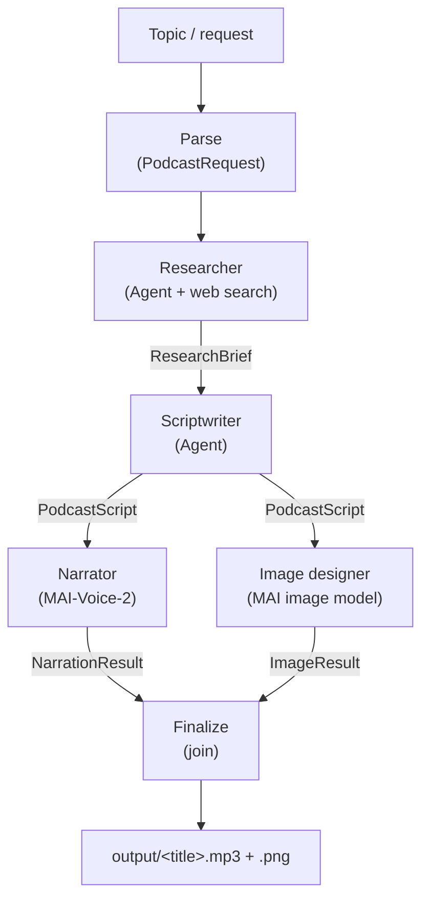

# Podcaster

[](https://github.com/jetzlstorfer/podcaster/actions/workflows/lint-and-build.yml)
[](https://github.com/jetzlstorfer/podcaster/actions/workflows/deploy.yml)

A multi-agent pipeline that turns a research question into a ready-to-play podcast — a two-host MP3 (with embedded cover art when available) plus AI-generated episode cover art 🎙️



After the script is written the graph **fans out** to two parallel branches
(narration + cover art), then **fans in** to a finalize step. The image branch is
non-blocking — any failure becomes a skip message so it never stalls the join.

| Agent / stage | Role |
|---|---|
| **Parse** | Decodes the incoming `{topic, length, language}` request (or a bare topic) into a `PodcastRequest` |
| **Researcher** | Uses the Foundry native web-search tool to gather real-time facts and sources → `ResearchBrief` |
| **Scriptwriter** | Writes a natural two-host dialogue (Alex ♂ / Jordan ♀) with intro, discussion, and outro → `PodcastScript` |
| **Narrator** | Synthesises the script to MP3 using **MAI-Voice-2** voices via the Azure Speech REST API *(optional; cover art is embedded into the MP3 at finalize when available)* |
| **Image designer** | Art-director agent writes a text-to-image prompt, then a **MAI image model** renders PNG cover art *(optional)* |

Built with **Microsoft Agent Framework** (`agent-framework-foundry`) and **Microsoft Foundry** (project `podcaster`, model `gpt-5-mini`).

---

## Prerequisites

- Python 3.11+
- `az login` — Azure CLI authenticated (keyless Entra ID auth, no API keys)
- A Foundry project with `gpt-5-mini` deployed (already set up: `podcaster-resource`)
- *(For cover art)* A MAI-family image model (default `MAI-Image-2.5-Flash`)
  deployed in the same Foundry project
- *(For audio)* An Azure Speech / Foundry resource in a MAI-Voice-2-supported
  region (e.g. `swedencentral`, `eastus`) with the **Cognitive Services Speech
  User** role assigned to your identity
- Use `.env` file for setting the environment variables
---

## Quick start

```bash
# 1. Install dependencies
make install

# 2. Copy and configure environment
cp .env.example .env   # already done if you cloned this repo
# Edit .env — FOUNDRY_PROJECT_ENDPOINT and FOUNDRY_MODEL are pre-filled.
# Add AZURE_SPEECH_ENDPOINT to enable audio output.

# 3. Run the pipeline (interactive devui server)
make run

# 4. Or run once from the command line
make cli Q="What are the latest breakthroughs in quantum computing?"
```

---

## Makefile targets

| Target | Description |
|---|---|
| `make install` | Install Python dependencies from `requirements.txt` |
| `make run` | Start the devui HTTP server on port 8088 (Agent Inspector) |
| `make web` | Start the FastAPI **AG-UI** backend on port 8089 (for the web UI) |
| `make ui` | Start the Vite dev server for the web UI (http://127.0.0.1:5173) |
| `make ui-build` | Build the SPA into `frontend/dist` (so `make web` serves API + UI on one origin) |
| `make cli Q="..."` | Run the full pipeline once and print the script |
| `make cli SCRIPT=output/My_Title.json` | Re-narrate a previously saved script (skips research + writing) |
| `make agent-wheels` | Build the shared `podcaster` wheel and vendor it into each hosted-agent service dir |
| `make test` | Run the test suite (synthesizes real MP3s into `output/`) |
| `make lint` | Run `ruff` linter across the source tree |
| `make clean` | Remove `__pycache__` dirs, generated MP3s, and build artifacts |

---

## Web UI (AG-UI)

A custom **Vite + React** front end talks to the pipeline over the
[AG-UI protocol](https://docs.ag-ui.com) using `@ag-ui/client`. It streams
per-stage progress (parse → research → write script → narrate ∥ image →
finalize), renders the two-host script, plays the generated MP3, and shows the
episode cover art in the browser. You can also pick a **length**
(short / medium / long) and **language** (English / German).

```bash
# Terminal 1 — start the AG-UI backend (FastAPI + uvicorn)
make web

# Terminal 2 — start the web UI
cd frontend && npm install   # first time only
make ui
```

Then open http://127.0.0.1:5173. The UI defaults to the backend at
`http://127.0.0.1:8089`; override with `VITE_BACKEND_URL` (see
`frontend/.env.example`).

- **Backend** — `server.py` mounts the workflow at `POST /podcast` via
  `add_agent_framework_fastapi_endpoint`, serves generated audio from `/audio`,
  cover art from `/images`, episode history from `GET /episodes` and
  `GET /episodes/{episode}.json`, and exposes `/healthz`. When built, it also
  serves the React SPA (`frontend/dist`) at `/`.
- **History source** — `GET /episodes` merges local `output/*.json` scripts with
  blob-backed scripts (when `AZURE_STORAGE_ACCOUNT_URL` is configured), sorted
  by most recently updated.
- **CORS defaults** — local Vite origins are allowed by default, plus a regex
  that permits common forwarded-dev URLs (Codespaces, tunnels, Gitpod).
  Override with `CORS_ORIGINS` and `CORS_ORIGIN_REGEX`.
- **Request shape** — the UI sends `{ "topic", "length", "language" }` as the
  message content; the workflow's `parse` stage validates it into a
  `PodcastRequest`. Plain-text messages still work and fall back to defaults.

---

## Deploy to Azure (azd)

[`azure.yaml`](azure.yaml) defines four services deployed with the Azure
Developer CLI (`azd up`): the three pipeline stages as **Foundry hosted agents**
(`src/researcher`, `src/scriptwriter`, `src/narrator`) and the **web** Container
App ([`Dockerfile`](Dockerfile)) that serves the API and the built React SPA.
Infrastructure lives in [`infra/`](infra/) (Bicep).

```bash
make agent-wheels   # vendor the shared podcaster wheel into each src/<agent>/
azd up              # provision infra + deploy all services
```

### Post-deployment: Assign roles to the Container App

Due to subscription ABAC (Attribute-Based Access Control) policies, role assignments
cannot be created during deployment. After `azd up` completes, manually assign the
Container App's managed identity the roles it needs to pull container images and
access blob storage:

```bash
# Get the web Container App's principal ID (printed at the end of azd up)
PRINCIPAL_ID="$(azd env get-values --output json | jq -r '.RESOURCE_GROUP_PRINCIPAL_ID // .WEB_IDENTITY_PRINCIPAL_ID')"

# Or retrieve it from Azure directly:
RESOURCE_GROUP="$(azd env get-values --output json | jq -r '.RESOURCE_GROUP_NAME // "rg-podcaster"')"
WEB_IDENTITY_ID="$(az container app show -n "pod*" -g "$RESOURCE_GROUP" --query "identity.principalId" -o tsv 2>/dev/null || echo '')"

# Get the registry and storage account resource IDs
ACR_ID="$(az acr show -n pod* -g "$RESOURCE_GROUP" --query id -o tsv 2>/dev/null)"
STORAGE_ID="$(az storage account show -n pod* -g "$RESOURCE_GROUP" --query id -o tsv 2>/dev/null)"

# Assign ACR Pull role (7f951dda-4ed3-4680-a7ca-43fe172d538d)
az role assignment create \
  --assignee-object-id "$PRINCIPAL_ID" \
  --assignee-principal-type ServicePrincipal \
  --role "AcrPull" \
  --scope "$ACR_ID"

# Assign Blob Data Contributor role (ba92f5b4-2d11-453d-a403-e96b0029c9fe)
az role assignment create \
  --assignee-object-id "$PRINCIPAL_ID" \
  --assignee-principal-type ServicePrincipal \
  --role "Storage Blob Data Contributor" \
  --scope "$STORAGE_ID"
```

Setting the `*_AGENT_NAME` env vars on the web app routes each stage to its
deployed hosted agent; leaving them blank runs every stage in-process. Generated
audio and script JSON can be uploaded to a private blob container and streamed
back through the backend's `/audio` + `/episodes` APIs (see
`AZURE_STORAGE_ACCOUNT_URL`).

---

## Project structure

```
Podcaster/
├── main.py                        # Entrypoint  --server / --cli (--question | --script)
├── server.py                      # FastAPI AG-UI backend (make web)
├── Makefile
├── requirements.txt               # App dependencies (make install)
├── pyproject.toml                 # Packages the shared `podcaster` library into a wheel
├── azure.yaml                     # azd: 3 hosted agents + web Container App
├── Dockerfile                     # Web Container App image (API + built SPA)
├── .env.example                   # Copy to .env and fill in values
├── .vscode/
│   ├── launch.json                # Debugger attach configs
│   └── tasks.json                 # agentdev server + Agent Inspector tasks
├── infra/                         # Bicep IaC for azd deploy
├── frontend/                      # Vite + React web UI (AG-UI client)
│   ├── index.html
│   └── src/
│       ├── App.tsx                # Form, progress stepper, script + audio + image
│       ├── api.ts                 # @ag-ui/client HttpAgent wiring
│       └── types.ts
├── output/                        # Generated <title>.{json,mp3,png} land here
├── tests/
│   ├── test_narrator.py           # Integration tests → synthesize real MP3s
│   ├── test_image_designer.py     # Image-designer prompt + MAI image tests
│   └── test_pipeline.py           # Unit tests (parse, length, language SSML)
├── src/                           # Hosted-agent service dirs (azd deploy targets)
│   ├── researcher/                # agent.yaml + main.py + vendored wheel
│   ├── scriptwriter/
│   └── narrator/
└── podcaster/                     # Shared library (importable package)
    ├── models.py                  # Pydantic: PodcastRequest, ResearchBrief, PodcastScript, NarrationResult, ImageResult
    ├── config.py                  # Env settings + VOICE_PRESETS + LANGUAGE_VOICES + style support
    ├── workflow.py                # Graph Workflow (WorkflowBuilder) + make_workflow()
    ├── orchestrator.py            # Runs each stage in-process or via a hosted agent
    ├── storage.py                 # Blob upload/stream for generated audio
    ├── observability.py           # Logging + optional OpenTelemetry setup
    └── agents/
        ├── researcher.py          # Agent + Foundry web-search tool
        ├── scriptwriter.py        # Agent → structured JSON dialogue
        ├── narrator.py            # MAI-Voice-2 REST → MP3
        ├── image_designer.py      # Art-director Agent + MAI image REST → PNG
        └── _resilience.py         # Retry/backoff + FoundryChatClient factory
```

---

## Environment variables (`.env`)

| Variable | Required | Description |
|---|---|---|
| `FOUNDRY_PROJECT_ENDPOINT` | ✅ | `https://<resource>.services.ai.azure.com/api/projects/<project>` |
| `FOUNDRY_MODEL` | ✅ | Chat deployment name (default: `gpt-5-mini`) |
| `FOUNDRY_MODEL_FALLBACK` | Optional | Failover chat deployment used after repeated 429s (needs independent quota) |
| `FOUNDRY_PROJECT_ENDPOINT_FALLBACK` | Optional | Endpoint for the failover deployment (different region) |
| `FOUNDRY_IMAGE_MODEL` | Image only | MAI image deployment in the same project (default: `MAI-Image-2.5-Flash`; blank disables cover art) |
| `IMAGE_SIZE` | Optional | Cover-art dimensions, PNG (default: `1024x1024`; each side ≥ 768) |
| `AZURE_SPEECH_ENDPOINT` | Audio only | `https://<region>.tts.speech.microsoft.com/` |
| `AZURE_SPEECH_RESOURCE_ID` | Audio (Entra) | Account-level ARM resource ID — required for Entra ID auth (see below) |
| `AZURE_SPEECH_KEY` | Optional | Only for resources with key auth enabled; leave blank to use Entra ID |
| `USE_SPEECH_ENTRA_AUTH` | Optional | `true` (default) to use `az login` / Entra ID |
| `PODCAST_VOICE_MALE` | Optional | Male voice (default: `en-US-Ethan:MAI-Voice-2`) |
| `PODCAST_VOICE_FEMALE` | Optional | Female voice (default: `en-US-Harper:MAI-Voice-2`) |
| `RESEARCHER_AGENT_NAME` / `SCRIPTWRITER_AGENT_NAME` / `NARRATOR_AGENT_NAME` | Optional | Route a stage to a **deployed** Foundry hosted agent instead of running it in-process (blank = local/in-process) |
| `AZURE_STORAGE_ACCOUNT_URL` | Optional | When set, the narrator uploads MP3s to a private blob container served via `/audio` (blank = local files) |
| `AZURE_STORAGE_CONTAINER` | Optional | Blob container name for audio (default: `audio`) |
| `CORS_ORIGINS` | Optional | Comma-separated allowlist for exact origins (default: `http://127.0.0.1:5173,http://localhost:5173`) |
| `CORS_ORIGIN_REGEX` | Optional | Regex allowlist for additional origins (defaults include localhost + common forwarded-dev domains) |
| `LOG_LEVEL` | Optional | Console log verbosity (default: `INFO`) |
| `ENABLE_OTEL` | Optional | `true` to enable Microsoft Agent Framework OpenTelemetry (default: `false`) |

---

## Running with the Agent Inspector

1. Press **F5** in VS Code and select *"Podcaster: HTTP Server (Agent Inspector)"*.
2. The Foundry Toolkit Agent Inspector opens automatically.
3. Type a research question (e.g. *"What is the current state of fusion energy?"*) and send it.
4. Watch the stages run (parse → research → write script → narrate ∥ image →
   finalize); find the MP3 and PNG in `output/` when done.

---

## Audio output (MAI-Voice-2)

The Narrator agent is **optional** — if `AZURE_SPEECH_ENDPOINT` is not set the
pipeline still runs and prints the full script. To enable audio you need a Speech
(or multi-service Foundry) resource whose region supports **MAI voices**
(e.g. `swedencentral`, `eastus`).

### Authentication (Entra ID / keyless)

Foundry resources typically have key auth **disabled**, so the Narrator uses
Entra ID. The Speech text-to-speech REST API requires the Entra token wrapped in
the `aad#<resourceId>#<token>` format, so two settings are needed:

```bash
# 1. The regional TTS endpoint
AZURE_SPEECH_ENDPOINT=https://swedencentral.tts.speech.microsoft.com/

# 2. The account-level ARM resource ID (NO /projects/... suffix)
AZURE_SPEECH_RESOURCE_ID=/subscriptions/<sub>/resourceGroups/<rg>/providers/Microsoft.CognitiveServices/accounts/<name>
```

Assign yourself the **Cognitive Services Speech User** role on that resource:

```bash
SCOPE="/subscriptions/<sub>/resourceGroups/<rg>/providers/Microsoft.CognitiveServices/accounts/<name>"
az role assignment create \
  --assignee-object-id "$(az ad signed-in-user show --query id -o tsv)" \
  --assignee-principal-type User \
  --role "Cognitive Services Speech User" \
  --scope "$SCOPE"
```

Leave `AZURE_SPEECH_KEY` blank to keep using keyless Entra ID auth.

> **Note on voice styles:** each turn carries a delivery *style* drawn from the
> emotions MAI-Voice-2 supports natively (e.g. `happy`, `excited`, `sad`,
> `whispering`). For the MAI hosts the Narrator renders these with
> `mstts:express-as` so the model performs the emotion; voices without native
> style support (standard neural voices, `en-US-Grant:MAI-Voice-2`) fall back to
> a `prosody` approximation, and `neutral` emits no style tag.

---

## Tests

```bash
make test          # or: python -m pytest -v tests/
```

The tests in [`tests/test_narrator.py`](tests/test_narrator.py) are **integration
tests** — they call the Azure Speech API and write real MP3s to `output/`. They
require `AZURE_SPEECH_ENDPOINT` (and `az login`); if the endpoint isn't
configured the tests are **skipped** so the suite still passes without Azure
access. [`tests/test_image_designer.py`](tests/test_image_designer.py) is also an
integration test but intentionally **opt-in**: set `RUN_IMAGE_INTEGRATION=1` to
run it. [`tests/test_pipeline.py`](tests/test_pipeline.py) holds fast unit tests
(request parsing, length specs, language SSML).

---

## Comparing voice models

`config.VOICE_PRESETS` maps a label to a `(male_voice, female_voice)` pair. The
test `test_voice_preset_generates_mp3` synthesizes one MP3 per preset into
`output/compare_<preset>.mp3` so you can A/B the audio quality:

```python
VOICE_PRESETS = {
    "mai2":     ("en-US-Ethan:MAI-Voice-2", "en-US-Harper:MAI-Voice-2"),
    "mai2-alt": ("en-US-Grant:MAI-Voice-2", "en-US-Olivia:MAI-Voice-2"),
    "neural":   ("en-US-AndrewNeural",      "en-US-AvaNeural"),
}
```

Add or edit entries in [`podcaster/config.py`](podcaster/config.py), then
run `make test` to regenerate the comparison clips. At runtime you can also pass
`voice_male` / `voice_female` directly to `run_narrator(...)`.
